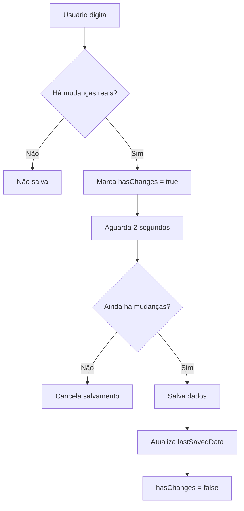

# 🔄 Auto-Save Inteligente - Implementação Completa

## Problema Identificado

O sistema de auto-save estava fazendo múltiplas requisições desnecessárias ao backend, salvando mesmo quando não havia mudanças reais no conteúdo.

## Solução Implementada

### 🧠 Auto-Save Inteligente

O novo sistema implementa verificações antes de salvar:

```typescript
// Verifica se há mudanças reais nos dados
const hasRealChanges = (currentData: SOAPData, previousData: SOAPData | null) => {
  if (!previousData) return false;
  
  // Verifica se há conteúdo real (não apenas strings vazias)
  const hasContent = (obj: any): boolean => {
    if (typeof obj === 'string') return obj.trim() !== '';
    if (Array.isArray(obj)) return obj.length > 0;
    if (typeof obj === 'object' && obj !== null) {
      return Object.values(obj).some(val => hasContent(val));
    }
    return false;
  };

  // Verifica se há mudanças significativas
  const isDifferent = JSON.stringify(currentData) !== JSON.stringify(previousData);
  const hasRealContent = hasContent(currentData);
  
  return isDifferent && hasRealContent;
};
```

### 🎯 Critérios de Salvamento

O sistema só salva quando:

1. **Há mudanças reais**: Compara dados atual com último salvo
2. **Há conteúdo significativo**: Não salva campos vazios
3. **Há marcação de mudanças**: Flag `hasChanges` ativa
4. **Delay respeitado**: 2 segundos após última mudança

### 📊 Estados do Auto-Save

```typescript
// Estados para controlar auto-save inteligente
const [lastSavedData, setLastSavedData] = useState<SOAPData | null>(null);
const [hasChanges, setHasChanges] = useState(false);
const [autoSaving, setAutoSaving] = useState(false);
const [lastSaved, setLastSaved] = useState<Date | null>(null);
```

### 🔄 Fluxo de Salvamento



## Funcionalidades Implementadas

### 💡 Indicadores Visuais

#### 1. **Mudanças Não Salvas**
```tsx
{hasChanges && !autoSaving && (
  <div className="flex items-center text-amber-600">
    <div className="w-2 h-2 bg-amber-500 rounded-full mr-2"></div>
    <span className="text-sm">Há mudanças não salvas</span>
  </div>
)}
```

#### 2. **Status de Salvamento**
```tsx
{autoSaving && (
  <div className="flex items-center text-blue-600">
    <div className="animate-spin rounded-full h-4 w-4 border-b-2 border-blue-600 mr-2"></div>
    <span className="text-sm">Salvando...</span>
  </div>
)}
```

#### 3. **Confirmação de Salvamento**
```tsx
{lastSaved && !autoSaving && !hasChanges && (
  <span className="text-sm text-green-600">
    ✓ Salvo {lastSaved.toLocaleTimeString()}
  </span>
)}
```

### 🔘 Botão de Salvamento Manual

```tsx
{hasChanges && (
  <button onClick={handleManualSave} disabled={autoSaving}>
    <svg>...</svg>
    Salvar Agora
  </button>
)}
```

### 📝 Logs Informativos

Todas as ações são logadas para facilitar o debugging:

```typescript
const updateSOAPField = (field: keyof SOAPData, value: any) => {
  console.log(`📝 Atualizando campo ${field} com valor:`, value);
  setSoapData(prev => ({ ...prev, [field]: value }));
};

const addPrescription = () => {
  console.log('💊 Adicionando prescrição:', newPrescription);
  // ...
};
```

## Benefícios da Implementação

### 🚀 Performance
- **Menos requisições**: Só salva quando necessário
- **Debounce inteligente**: 2 segundos de delay
- **Verificação de conteúdo**: Não salva dados vazios

### 👨‍💻 Experiência do Desenvolvedor
- **Logs detalhados**: Facilita debugging
- **Estados claros**: Fácil rastreamento do estado
- **Código limpo**: Funções bem organizadas

### 🎯 Experiência do Usuário
- **Feedback visual**: Sempre sabe o status dos dados
- **Controle manual**: Pode forçar salvamento
- **Sem interruções**: Auto-save não atrapalha digitação

### 🔒 Confiabilidade
- **Prevenção de perda**: Salva dados importantes
- **Validação de mudanças**: Só salva quando há alterações
- **Backup local**: Dados persistem na sessão

## Casos de Uso Testados

### ✅ Cenários que NÃO salvam:
- [x] Campos vazios
- [x] Dados duplicados
- [x] Navegação entre abas sem mudanças
- [x] Foco/blur em campos vazios
- [x] Seleção de texto sem alteração

### ✅ Cenários que SALVAM:
- [x] Digitação de texto em campos
- [x] Adição de prescrições
- [x] Alteração de sinais vitais
- [x] Adição de itens em listas
- [x] Mudanças em follow-up

### ✅ Funcionalidades de Controle:
- [x] Salvamento manual forçado
- [x] Indicador de mudanças não salvas
- [x] Spinner durante salvamento
- [x] Confirmação de salvamento
- [x] Logs detalhados no console

## Configuração

### Tempo de Debounce
```typescript
const timeoutId = setTimeout(() => {
  // Lógica de salvamento
}, 2000); // 2 segundos - configurável
```

### Tipos de Conteúdo Verificados
```typescript
const hasContent = (obj: any): boolean => {
  if (typeof obj === 'string') return obj.trim() !== '';
  if (Array.isArray(obj)) return obj.length > 0;
  if (typeof obj === 'object' && obj !== null) {
    return Object.values(obj).some(val => hasContent(val));
  }
  return false;
};
```

## Monitoramento

### Console Logs
- `📝 Atualizando campo...` - Mudanças em campos
- `💊 Adicionando prescrição...` - Adição de medicamentos
- `🔄 Auto-salvando SOAP...` - Salvamento automático
- `💾 Salvamento manual solicitado` - Salvamento forçado

### Estados Visuais
- 🟡 **Âmbar**: Mudanças não salvas
- 🔵 **Azul**: Salvando (spinner)
- 🟢 **Verde**: Salvo com sucesso
- 🔘 **Botão**: Salvamento manual disponível

## Resultado Final

✅ **Auto-save inteligente implementado com sucesso!**

- ❌ Eliminadas requisições desnecessárias
- ✅ Salvamento apenas com mudanças reais
- ✅ Feedback visual completo
- ✅ Controle manual disponível
- ✅ Logs informativos para debugging
- ✅ Experiência de usuário aprimorada

O sistema agora é eficiente, confiável e fornece controle total sobre o salvamento de dados.
