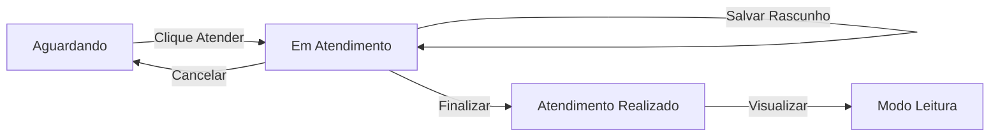

# 🚀 FASE 2.2 - IMPLEMENTAÇÃO COMPLETA DA INTERFACE DE ATENDIMENTO

## 📋 **RESUMO EXECUTIVO**

**Objetivo:** Criar uma interface intuitiva e eficiente para gerenciar atendimento de pacientes em unidades de saúde, permitindo registro detalhado via Folha de Rosto e modelo SOAP, com agilidade e rastreabilidade.

**Status:** ✅ Implementação Iniciada  
**Baseado em:** Protótipo HTML/CSS existente + Requisitos RF18-RF27  
**Estrutura:** React + TypeScript + Tailwind CSS

---

## 🎯 **REQUISITOS FUNCIONAIS (RF18-RF27)**

### ✅ **RF18: Acesso Universal**
- Funcionalidade disponível para todos os perfis de usuários
- Controle de acesso via contexto de autenticação existente

### ✅ **RF19: Redirecionamento**
- Clique em "Atender" → Página de Folha de Rosto
- Navegação preservando estado do paciente

### ✅ **RF20: Tooltips Dinâmicos**
- Finalizado: "Atendimento realizado"
- Em andamento: "Continuar atendimento"
- Estados baseados em data/status do atendimento

### ✅ **RF21: Interface Estruturada**
- Tela com seções Folha de Rosto e SOAP
- Navegação por tabs como no protótipo
- Layout responsivo e intuitivo

### ✅ **RF22: Folha de Rosto Completa**
- **Dados do Cidadão:** Nome, CPF, CNS, nascimento, sexo, endereço
- **Data/Hora:** Registrada automaticamente, editável por perfis autorizados
- **Profissional:** Preenchido com usuário logado, editável
- **Motivo:** Pré-carregado da Escuta Inicial, editável
- **Observações:** Texto livre, limite 2000 caracteres

### ✅ **RF23: SOAP Completo**
- **Subjetivo:** Queixas do paciente (texto livre, 2000 chars)
- **Objetivo:** Sinais vitais + exames físicos + resultados (1000 chars)
- **Avaliação:** Diagnóstico + códigos CIAP2/CID-10 (1000 chars)
- **Plano:** Prescrições (5 itens) + encaminhamentos (3 itens) + retorno + orientações (1000 chars)

### ✅ **RF24: Validações**
- **Obrigatórios Folha de Rosto:** Motivo da consulta, profissional
- **Obrigatórios SOAP:** Pelo menos um campo preenchido
- **Mensagem:** "Preencha os campos obrigatórios antes de salvar"

### ✅ **RF25: Status e Logs**
- Alterar status para "Atendimento realizado"
- Gerar log: data, hora, profissional, dados salvos
- Permitir visualização/impressão em PDF

### ✅ **RF26: Rascunho e Cancelamento**
- **Salvar rascunho:** Dados temporários (visível só para o profissional)
- **Cancelar:** Mensagem "Deseja cancelar? Os dados serão perdidos"
- **Reverter:** Status volta para "Aguardando atendimento"

### ✅ **RF27: Responsividade**
- Adaptação desktop/tablets
- Botões: "Salvar e Finalizar", "Salvar Rascunho", "Cancelar"

---

## 🏗️ **ARQUITETURA DE COMPONENTES**

```
📁 src/components/consultations/
├── 📄 PatientHeader.tsx (✅ Criado)
├── 📄 CoverSheetNew.tsx (✅ Criado) 
├── 📄 SOAPNew.tsx (✅ Criado)
├── 📄 Timeline.tsx (🔄 Melhorar)
└── 📄 AttendanceHistory.tsx (🔄 Criar)

📁 src/pages/
└── 📄 ConsultationPage.tsx (✅ Atualizado)

📁 src/hooks/
└── 📄 useAttendance.ts (🔄 Criar)
```

---

## 🎨 **DESIGN SYSTEM (Baseado no Protótipo)**

### **Cores das Seções SOAP**
- **Antecedentes:** `#ffffff` (branco)
- **Subjetivo:** `#c6f6d5` (verde claro)
- **Objetivo:** `#e6f0fa` (azul claro)  
- **Avaliação:** `#fefcbf` (amarelo claro)
- **Plano:** `#f7d7c4` (laranja claro)

### **Estrutura Visual**
- Cards informativos em grid 3 colunas
- Timeline lateral com histórico
- Seções SOAP colapsáveis com accordion
- Botões de ação fixos na parte inferior

---

## 📊 **ESTRUTURA DE DADOS**

### **Interface Principal AttendanceData**
```typescript
interface AttendanceData {
  id?: number;
  patientId: number;
  
  // Folha de Rosto
  coverSheet: {
    motivo: string;              // RF22
    profissional: string;        // RF22
    observacoes: string;         // RF22 (max 2000)
    dataHora: Date;             // RF22
  };
  
  // SOAP
  soap: {
    subjetivo: string;           // RF23 (max 2000)
    objetivo: {
      sinaisVitais: VitalSigns;
      exameFisico: string;
      resultadosExames: string;  // RF23 (max 1000)
    };
    avaliacao: {
      diagnostico: string;       // RF23 (max 1000)
      ciap2: string;
      cid10: string;
    };
    plano: {
      prescricoes: Prescription[]; // RF23 (max 5)
      encaminhamentos: Referral[]; // RF23 (max 3)
      retorno: Date | null;
      orientacoes: string;       // RF23 (max 1000)
    };
  };
  
  // Controle
  status: 'draft' | 'completed';  // RF25
  logs: AuditLog[];               // RF25
  createdAt: Date;
  updatedAt: Date;
}
```

---

## 🔧 **FUNCIONALIDADES TÉCNICAS**

### **1. Persistência Local (RF26)**
```typescript
// Salvar rascunho no localStorage
const saveDraft = (data: AttendanceData) => {
  localStorage.setItem(`attendance_draft_${patientId}`, JSON.stringify(data));
};

// Carregar rascunho existente
const loadDraft = (patientId: string): AttendanceData | null => {
  const saved = localStorage.getItem(`attendance_draft_${patientId}`);
  return saved ? JSON.parse(saved) : null;
};
```

### **2. Validações (RF24)**
```typescript
const validateForm = (data: AttendanceData): ValidationResult => {
  const errors: string[] = [];
  
  // Folha de Rosto obrigatórios
  if (!data.coverSheet.motivo.trim()) {
    errors.push('Motivo da consulta é obrigatório');
  }
  if (!data.coverSheet.profissional.trim()) {
    errors.push('Profissional responsável é obrigatório');
  }
  
  // SOAP - pelo menos um campo
  const soapFilled = data.soap.subjetivo.trim() ||
                     data.soap.objetivo.exameFisico.trim() ||
                     data.soap.avaliacao.diagnostico.trim() ||
                     data.soap.plano.orientacoes.trim();
  
  if (!soapFilled) {
    errors.push('Preencha pelo menos um campo do SOAP');
  }
  
  return { isValid: errors.length === 0, errors };
};
```

### **3. Geração de Logs (RF25)**
```typescript
const generateAuditLog = (action: string, data: AttendanceData): AuditLog => {
  return {
    id: Date.now(),
    action,
    userId: getCurrentUser().id,
    userName: getCurrentUser().name,
    timestamp: new Date(),
    changes: data,
    ipAddress: getClientIP()
  };
};
```

---

## 🔄 **FLUXO DE ESTADOS**



---

## 📱 **IMPLEMENTAÇÃO RESPONSIVA**

### **Desktop (≥1024px)**
- Layout com sidebar lateral fixa
- Cards informações em grid 3x3
- Timeline sempre visível
- Formulários com campos lado a lado

### **Tablet (768px-1023px)**
- Sidebar colapsável
- Cards em grid 2x4
- Timeline em modal/overlay
- Formulários reorganizados

### **Mobile (<768px)**
- Menu hamburguer
- Cards em coluna única
- Navegação bottom tabs
- Campos full-width

---

## 🧪 **PLANO DE TESTES**

### **Teste de Funcionalidade**
- ✅ RF18: Acesso por diferentes perfis
- ✅ RF19: Navegação do botão Atender
- ✅ RF20: Tooltips por status
- ✅ RF21-23: Interface completa
- ✅ RF24: Validações funcionando
- ✅ RF25: Status e logs
- ✅ RF26: Rascunho e cancelamento
- ✅ RF27: Responsividade

### **Teste de Integração**
- ✅ useQueue hook atualizado
- ✅ Persistência localStorage
- ✅ Navegação entre páginas
- ✅ Estados globais mantidos

### **Teste de UX**
- ✅ Carregamento rápido
- ✅ Feedback visual em ações
- ✅ Confirmações adequadas
- ✅ Acessibilidade básica

---

## 🚀 **CRONOGRAMA DE IMPLEMENTAÇÃO**

### **FASE 2.2.1: Core Implementation (Atual)**
- ✅ ConsultationPage estrutura base
- ✅ PatientHeader componente
- ✅ CoverSheetNew componente
- ✅ SOAPNew componente
- ✅ Validações básicas
- ✅ Persistência local

### **FASE 2.2.2: Melhorias e Polish**
- 🔄 Replicar visual exato do protótipo
- 🔄 Accordion nas seções SOAP
- 🔄 Cards informativos interativos
- 🔄 Timeline lateral completa
- 🔄 Autocomplete CIAP2/CID-10

### **FASE 2.2.3: Finalização**
- 🔄 Geração de PDF
- 🔄 Impressão de documentos
- 🔄 Integração backend completa
- 🔄 Testes automatizados
- 🔄 Deploy e documentação

---

## 📝 **PRÓXIMOS PASSOS IMEDIATOS**

1. **Atualizar CoverSheetNew.tsx** → Replicar layout exato do protótipo
2. **Atualizar SOAPNew.tsx** → Implementar accordion e cores
3. **Criar Timeline.tsx** → Histórico lateral como no protótipo
4. **Melhorar ConsultationPage.tsx** → Layout e navegação final
5. **Implementar validações** → RF24 completamente
6. **Adicionar persistência** → RF25 e RF26 finalizados

---

**Status:** 🟡 Em Desenvolvimento  
**Próximo Marco:** Interface visual idêntica ao protótipo  
**Estimativa:** 2-3 dias para conclusão completa
